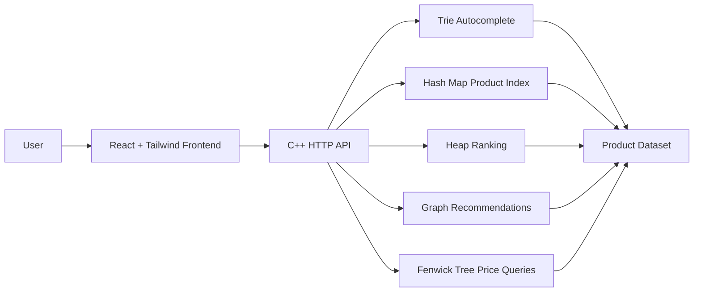

# Smart E-Commerce Search and Recommendation System using Advanced DSA

## 1. Project Overview

The **Smart E-Commerce Search and Recommendation System** is a full-stack web application that demonstrates how advanced data structures can improve product discovery in an online shopping platform. The system provides fast product autocomplete, product ranking, product recommendations, and price range filtering through a connected frontend and backend.

The project combines a modern animated React frontend with a C++ backend API. The backend implements core data structures from scratch and exposes them through HTTP endpoints. The frontend consumes those endpoints and presents the results in a premium, Apple-inspired product interface.

## 2. Problem Statement

Modern e-commerce platforms need to help users find relevant products quickly. A basic search bar is not enough because users expect:

- Instant autocomplete while typing.
- Quick access to top-rated, cheapest, or most popular products.
- Smart recommendations based on related products.
- Efficient filtering by price range.
- A smooth and professional user interface.

This project solves these requirements using advanced data structures and a responsive full-stack architecture.

## 3. Objectives

- Build a professional e-commerce product discovery interface.
- Implement autocomplete using a Trie.
- Store and retrieve product metadata using hash maps.
- Rank products using a Heap.
- Recommend related products using a Graph.
- Support price range queries using a Fenwick Tree.
- Connect a React frontend with a C++ backend.
- Create a modern animated landing page with Tailwind CSS.

## 4. Technology Stack

| Layer | Technology |
|---|---|
| Frontend | React, Vite |
| Styling | Tailwind CSS |
| Icons | Lucide React |
| Backend | C++17 |
| Server | Dependency-free POSIX socket HTTP server |
| Build Tool | Makefile |
| Version Control | Git and GitHub |

## 5. System Architecture



The frontend runs on `http://localhost:5173` and proxies API requests to the backend running on `http://localhost:4000`.

## 6. Data Structures Used

### 6.1 Trie

The Trie is used for product search autocomplete. Product names and tags are inserted into the Trie. When the user types a prefix, the backend quickly returns matching products.

Example:

```text
Input: sho
Output: Velocity Knit Running Shoes, Airflow Training Shorts, Metro Shoulder Bag
```

Benefits:

- Fast prefix lookup.
- Better autocomplete experience.
- Works with both product names and tags.

### 6.2 Hash Map

Hash maps are used for direct product lookup and category indexing.

Usage:

- Product ID to product details.
- Category name to product count.
- Fast access during recommendation lookup.

Benefits:

- Average constant-time lookup.
- Simple product metadata retrieval.
- Efficient API response construction.

### 6.3 Heap

A priority queue heap is used for ranking products. The user can view:

- Top-rated products.
- Cheapest products.
- Most popular products.

Benefits:

- Efficient top-K product selection.
- Supports multiple ranking strategies.
- Useful for e-commerce sorting and discovery.

### 6.4 Graph

The graph represents relationships between products. Each product is a node, and related products are connected by edges.

Example:

```text
Phone -> Charger -> Laptop -> Mouse
Phone -> Earphones -> Smart Watch
Phone -> Phone Case
```

Benefits:

- Models product relationships.
- Enables recommendation traversal.
- Supports related-product discovery.

### 6.5 Fenwick Tree

The Fenwick Tree is used for price bucket range counting. Products are grouped into price buckets, and the tree efficiently calculates how many products fall within a selected range.

Example:

```text
Show products between ₹500 and ₹2000
```

Benefits:

- Efficient range sum query.
- Useful for price analytics.
- Demonstrates advanced range-query logic.

## 7. Backend Implementation

The backend is implemented in C++17 and located at:

```text
backend/src/main.cpp
```

It includes:

- Product dataset.
- Trie implementation.
- Fenwick Tree implementation.
- Graph implementation.
- Heap-based product ranking.
- Hash map indexing.
- Lightweight HTTP request handling using POSIX sockets.

The backend can be built and run using:

```bash
make -C backend
make -C backend run
```

## 8. API Endpoints

| Endpoint | Method | Description |
|---|---|---|
| `/api/health` | GET | Checks backend health |
| `/api/products` | GET | Returns all products |
| `/api/categories` | GET | Returns category counts |
| `/api/search?q=sho` | GET | Returns Trie autocomplete results |
| `/api/top?mode=rating&limit=5` | GET | Returns ranked products |
| `/api/recommendations/:id` | GET | Returns graph-based recommendations |
| `/api/range?min=500&max=2000` | GET | Returns products in price range |

## 9. Frontend Implementation

The frontend is implemented with React, Vite, Tailwind CSS, and Lucide icons.

Main file:

```text
frontend/src/App.jsx
```

Styling file:

```text
frontend/src/index.css
```

Frontend features:

- Apple-inspired animated landing page.
- Sticky glass navigation.
- Auto-rotating product spotlight.
- Live autocomplete search.
- Product ranking tabs.
- Graph recommendation panel.
- Price range query panel.
- Animated product marquee.
- Scroll progress indicator.
- Smooth hover and reveal animations.

## 10. User Interface Design

The user interface uses a premium product-showcase style inspired by modern Apple product pages. The design focuses on:

- Large centered hero typography.
- Clean spacing.
- Glassmorphism panels.
- Dark cinematic product stage.
- Smooth animations.
- Product-focused imagery.
- Clear visual hierarchy.

The UI is responsive and works across desktop and mobile screen sizes.

## 11. Project Workflow

1. User opens the frontend at `http://localhost:5173`.
2. React loads product data from the backend.
3. User searches for a product.
4. Frontend sends `/api/search` request.
5. C++ backend queries the Trie.
6. Results are returned and displayed instantly.
7. User can select products to update graph recommendations.
8. User can switch ranking modes powered by Heap logic.
9. User can filter products by price range using Fenwick Tree results.

## 12. How to Run the Project

Install dependencies:

```bash
npm run install:all
```

Build the C++ backend:

```bash
npm run backend:build
```

Run frontend and backend together:

```bash
npm run dev
```

Open:

```text
http://localhost:5173
```

## 13. Testing and Verification

The project was verified using:

```bash
make -C backend
npm run lint --prefix frontend
npm run build
```

API smoke tests were also performed for:

- Health endpoint.
- Search endpoint.
- Top products endpoint.
- Recommendation endpoint.
- Price range endpoint.

## 14. Advantages of the System

- Demonstrates practical use of advanced DSA.
- Uses C++ for backend algorithm performance.
- Provides a modern professional frontend.
- Clean separation between frontend and backend.
- Easy to run locally.
- Suitable for academic presentation and portfolio use.

## 15. Limitations

- Product data is currently stored in memory.
- No database integration yet.
- No user authentication.
- Recommendation logic is graph-based, not machine-learning based.
- HTTP server is intentionally lightweight for project simplicity.

## 16. Future Scope

- Add database support using MySQL, PostgreSQL, or MongoDB.
- Add user login and personalized recommendations.
- Add cart and checkout flow.
- Add admin panel for product management.
- Add collaborative filtering or ML-based recommendations.
- Add deployment using Docker.
- Add unit tests for all DSA modules.

## 17. Conclusion

The Smart E-Commerce Search and Recommendation System successfully demonstrates how advanced data structures can solve real-world e-commerce problems. By combining Trie, Hash Map, Heap, Graph, and Fenwick Tree with a C++ backend and animated React frontend, the project provides both technical depth and a professional user experience.

This makes the project useful for learning, academic demonstration, and portfolio presentation.
